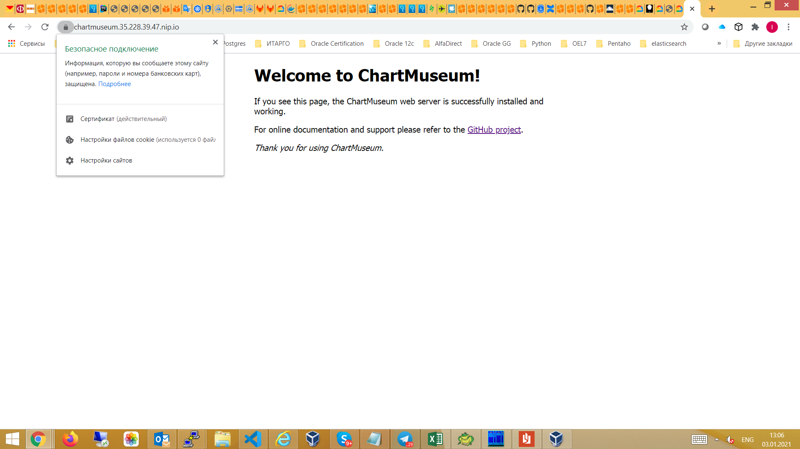
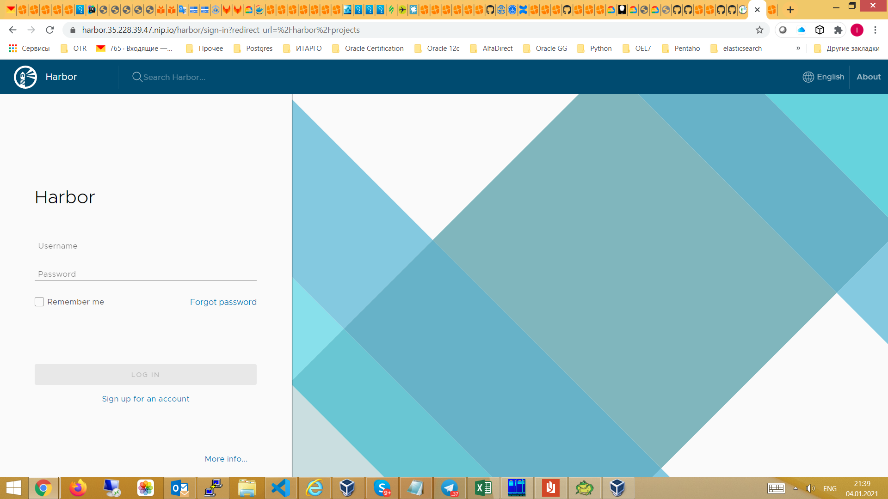

# itokareva_platform
itokareva Platform repository

  
## Домашняя работа 1

  ## Настройка локального Настройка локального окружения. Запуск окружения. 
  ## Запуск первого контейнера. первого контейнера. Работа с kubectl 

1) Установлен minikube и запущена виртуальная машина с кластером Kubernetes
2) Создан Dockerfile:

   - Запускающий web-сервер на порту 8000 
   - Отдающий содержимое директории /app внутри контейнера
     (например, если в директории /app лежит файл homework.html, то при запуске контейнера данный файл должен быть доступен 
      по URL http://localhost:8000/homework.html)
3) Построен образ контейнера и размещен в публичном Container Registry: itokareva/web:1.0
4) Создан манифест web-pod.yaml для создания pod web c меткой app со значением web, содержащего один контейнер с названием web
5) Добавлен init-контейнер, генерирующий страницу index.html во внутрь пода web
6) Выполнен port-forward и проверена работа приложения
7) Знакомство с приложеним Hipster Shop. Микросервис frontend склонирован, построен образ itokareva/hipster-frontend:1.0 
   и размещен на Docker Hub 
8) Использован ad-hoc режим для генерации манифеста frontend-pod.yaml

   Задание со (*)
9) Выяснена причина, по которой pod frontend находится в статусе Error: не объявлены переменные среды. 
   Исправлено в манифесте frontend-pod-healthy.yaml.  pod frontend - находится в статусе Running.

10)   
   Задание: Разберитесь почему все pod в namespace kube-system восстановились после удаления. 

   core-dns - восстанавливается, потому что kubernetes works in a declarative manner, which means we declare what the desired state should 
   be and kubernetes manages it for us. Control-manager is the component which is responsible for keeping track and maintaining the 
   required state by interacting with api-server and various controllers. So, it can also be treated as the interacting medium between 
   various controllers and api-server.
   
   kube-apiserver - желаемое состояние хранится в etcd. В локальном кластере используются статические поды.
   Полная информация здесь: https://kubernetes.io/docs/tasks/configure-pod-container/static-pod/

   В миникубе за всеми подами из plain panale присматривает kubelet. Заходим в VM minikube ssh и смотрим.
   Сам kubelet запускается, как deamon.
   ● kubelet.service - kubelet: The Kubernetes Node Agent
   Loaded: loaded (/usr/lib/systemd/system/kubelet.service; disabled; vendor preset: enabled)
  Drop-In: /etc/systemd/system/kubelet.service.d
           └─10-kubeadm.conf
   Active: active (running) since Wed 2020-12-16 16:53:07 UTC; 36min ago
     Docs: http://kubernetes.io/docs/
 Main PID: 2828 (kubelet)
    Tasks: 21 (limit: 2363)
   Memory: 113.9M
   CGroup: /system.slice/kubelet.service
           └─2828 /var/lib/minikube/binaries/v1.19.2/kubelet --bootstrap-kubeconfig=/etc/kubernetes/bootstrap-kubelet.conf --config=/var/lib/kubelet/config.yaml --container-runtime=docker --hostname-override=minikube --kubeconfig=/etc/kubernetes/kubelet.conf --node-ip=192.168.99.100

   В конфиг-файле kubelet /etc/kubernetes/kubelet.conf прописан путь:

   staticPodPath: /etc/kubernetes/manifests   
 
   Здесь лежат статичиские yaml-файлы, которые kubelet использует для рестарта etcd, kube-apiserver, kube-controller-manager, kube-scheduler: 

   $ ls /etc/kubernetes/manifests/
etcd.yaml  kube-apiserver.yaml  kube-controller-manager.yaml  kube-scheduler.yaml

   Сам kubelet рестартует VM.

  
## Домашняя работа 2

  ## Kubernetes controllers. Kubernetes controllers. ReplicaSet, Deployment, ReplicaSet, Deployment, DaemonSet 

1) Установлен kind и развернут k8s кластер по шаблону:

kind: Cluster
apiVersion: kind.sigs.k8s.io/v1alpha3
nodes: 
- role: control-plane
- role: control-plane
- role: control-plane
- role: worker
- role: worker
- role: worker   

2) ReplicaSet
   Почему обновление версии ReplicaSet не повлекло обновление запущенных pod?
   - потому что количество реплик было ограничено до 3, а мы выполнили apply  и это был бы уже 4-ый под
3) Deployment
3.1)
   - выкатка версии по default стратегии Update:
   
     - Создание одного нового pod с версией образа v2.0
     - Удаление одного из старых pod 
     - Создание еще одного нового pod

kubectl get replicaset  paymentservice-778bddd87 -o=jsonpath='{.spec.template.spec.containers[0].image}'
itokareva/hipster-paymentservice:2.0
kubectl get replicaset paymentservice-7d457979f8 -o=jsonpath='{.spec.template.spec.containers[0].image}'
itokareva/hipster-paymentservice:1.0
kubectl get pods -l app=paymentservice -o=jsonpath='{.items[0:3].spec.containers[0].image}'
itokareva/hipster-paymentservice:2.0 itokareva/hipster-paymentservice:2.0 itokareva/hipster-paymentservice:2.0
3.2) 
   - выкатка версии по стпатегии blue-green
     - Развертывание трех новых pod 
     - Удаление трех старых pod
3.3)
   - выкатка вырсии по стратегии Reverse Rolling Update 
     - Удаление одного старого pod 
     - Создание одного нового pod 
4) Примен манифест с frontend-deployment.yaml readinessProbe и с версией itokareva/hipster-frontend:1.0. В описании контейнера видим:

   Containers:
  server:
    Container ID:   containerd://e153d21784690868614dcafe819242e26be939edf169e05299075aa5cc29c2bf
    Image:          itokareva/hipster-frontend:1.0
    Image ID:       docker.io/itokareva/hipster-frontend@sha256:ffa410a06cc23df8b2dc84f983e8ed1ff22a7b73a8fdb2acaf27aeb31057c94e
    Port:           8080/TCP
    Host Port:      0/TCP
    State:          Running
      Started:      Thu, 10 Dec 2020 22:22:17 +0300
    Ready:          False
    Restart Count:  0
    Readiness:      http-get http://:8080/_healthz delay=10s timeout=1s period=10s #success=1 #failure=3

5) Выкатили itokareva/hipster-frontend:2.0 с ошибочным path: http://10.244.5.12:8080/_health. Выкатка не пошла, потому что
   проверка Readiness не прошла.

Warning  Unhealthy  9s (x7 over 69s)  kubelet, kind-worker2  Readiness probe failed: Get http://10.244.5.12:8080/_health: dial tcp 10.244.5.12:8080: connect: connection refused

6) Deamonset

6.1) Применен манифест node-exporter-daemonset-work.yaml - экспортеры развернут только на worker-nodes

NAME                  READY   STATUS    RESTARTS   AGE   IP           NODE           NOMINATED NODE   READINESS GATES
node-exporter-8hrm5   1/1     Running   0          27s   10.244.3.7   kind-worker    <none>           <none>
node-exporter-dq2sx   1/1     Running   0          27s   10.244.4.7   kind-worker3   <none>           <none>
node-exporter-wldhx   1/1     Running   0          27s   10.244.5.7   kind-worker2   <none>           <none>

6.2) Применен манифест node-exporter-daemonset.yaml c tolerations - экспортеры развернуты как на мастер, так и worker-нодах.

   На worker2:

Events:
  Type    Reason     Age    From                   Message
  ----    ------     ----   ----                   -------
  Normal  Scheduled  8m53s  default-scheduler      Successfully assigned default/node-exporter-6qscr to kind-worker2
  Normal  Pulling    8m51s  kubelet, kind-worker2  Pulling image "quay.io/prometheus/node-exporter:v1.0.1"
  Normal  Pulled     8m8s   kubelet, kind-worker2  Successfully pulled image "quay.io/prometheus/node-exporter:v1.0.1"
  Normal  Created    8m2s   kubelet, kind-worker2  Created container node-exporter
  Normal  Started    8m     kubelet, kind-worker2  Started container node-exporter
  Normal  Pulling    8m     kubelet, kind-worker2  Pulling image "quay.io/brancz/kube-rbac-proxy:v0.8.0"
  Normal  Pulled     7m8s   kubelet, kind-worker2  Successfully pulled image "quay.io/brancz/kube-rbac-proxy:v0.8.0"
  Normal  Created    7m6s   kubelet, kind-worker2  Created container kube-rbac-proxy
  Normal  Started    7m4s   kubelet, kind-worker2  Started container kube-rbac-proxy

   На мастере (control-plane2):

Events:
  Type    Reason     Age    From                          Message
  ----    ------     ----   ----                          -------
  Normal  Scheduled  7m23s  default-scheduler             Successfully assigned default/node-exporter-42q8r to kind-control-plane2
  Normal  Pulling    7m21s  kubelet, kind-control-plane2  Pulling image "quay.io/prometheus/node-exporter:v1.0.1"
  Normal  Pulled     6m24s  kubelet, kind-control-plane2  Successfully pulled image "quay.io/prometheus/node-exporter:v1.0.1"
  Normal  Created    6m23s  kubelet, kind-control-plane2  Created container node-exporter
  Normal  Started    6m23s  kubelet, kind-control-plane2  Started container node-exporter
  Normal  Pulling    6m23s  kubelet, kind-control-plane2  Pulling image "quay.io/brancz/kube-rbac-proxy:v0.8.0"
  Normal  Pulled     5m41s  kubelet, kind-control-plane2  Successfully pulled image "quay.io/brancz/kube-rbac-proxy:v0.8.0"
  Normal  Created    5m39s  kubelet, kind-control-plane2  Created container kube-rbac-proxy
  Normal  Started    5m38s  kubelet, kind-control-plane2  Started container kube-rbac-proxy

NOTE:
 
- Tolerations are applied to pods, and allow (but do not require) the pods to schedule onto nodes with matching taints.

- There are two special cases:
  An empty key with operator Exists matches all keys, values and effects which means this will tolerate everything.

An empty effect matches all effects with key key1.

  
## Домашняя работа 3

  ## Безопасность и управление доступом 

  -  Решение задач task01, task02, task03 в  .yaml-файлах в одноименных каталогах.

  
## Домашняя работа 4

  ## Сетевая подсистема Kubernetes

1) Создание Service
   -  создание сервиса с типом ClusterIP 
   -  разбор цепочек правил перенаправления трафика в iptables
   -  включение IPVS для kube-proxy
   -  исследоваие конфигурации через ipvsadm:

   TCP  10.111.37.78:80 rr
  -> 172.17.0.9:8000              Masq    1      0          0
  -> 172.17.0.10:8000             Masq    1      0          0
  -> 172.17.0.11:8000             Masq    1      0          0

   Пинг к ClusterIP уже работает:
$ ping -c1 10.111.37.78
PING 10.111.37.78 (10.111.37.78): 56 data bytes
64 bytes from 10.111.37.78: seq=0 ttl=64 time=1.835 ms 
--- 10.111.37.78 ping statistics ---
1 packets transmitted, 1 packets received, 0% packet loss
round-trip min/avg/max = 1.835/1.835/1.835 ms
   	 
2) Установка MetalLB в Layer2-режиме 
  
   - установка MetalLB
   - настройка балансировщика с помощью ConfigMap
   - посмотр логов пода-контроллера MetalLB, чтобы увидеть как назначаются ip-адреса балансировщикам:

{"caller":"service.go:114","event":"ipAllocated","ip":"172.17.255.1","msg":"IP address assigned by controller","service":"default/web-svc-lb","ts":"2020-12-17T19:49:48.676538589Z"}

Name:                     web-svc-lb
Namespace:                default
Labels:                   <none>
Annotations:              kubectl.kubernetes.io/last-applied-configuration:
                            {"apiVersion":"v1","kind":"Service","metadata":{"annotations":{},"name":"web-svc-lb","namespace":"default"},"spec":{"ports":[{"port":80,"p...
Selector:                 app=web
Type:                     LoadBalancer
IP:                       10.101.95.125
LoadBalancer Ingress:     172.17.255.1
Port:                     <unset>  80/TCP
TargetPort:               8000/TCP
NodePort:                 <unset>  30388/TCP
Endpoints:                172.17.0.10:8000,172.17.0.11:8000,172.17.0.9:8000
Session Affinity:         None
External Traffic Policy:  Cluster
Events:
  Type    Reason        Age    From                Message
  ----    ------        ----   ----                -------
  Normal  IPAllocated   8m17s  metallb-controller  Assigned IP "172.17.255.1"
  Normal  nodeAssigned  8m16s  metallb-speaker     announcing from node "minikube"

   - проверка конфигурации:
     
     -  пробрасываем маршрут:
        sudo ip route add 172.17.255.0/24 via 192.168.99.100 
     - проверяем, что ссылка работает в браузере или через curl:
        sudo ip route add 172.17.255.0/24 via 192.168.99.100 +
        curl http://172.17.255.1/index.html

   Задание со (*)

   Создан сервис LoadBalancer , который открывает доступ к CoreDNS снаружи кластера (позволяет получать записи через внешний IP).
   Сервис работает по протоколам TCP и UDP на одно ip-адресе балансировщика.
   Использована аннотация: metallb.universe.tf/allow-shared-ip

   kubectl get svc -n kube-system
NAME             TYPE           CLUSTER-IP       EXTERNAL-IP    PORT(S)                  AGE
kube-dns         ClusterIP      10.96.0.10       <none>         53/UDP,53/TCP,9153/TCP   88d
metrics-server   ClusterIP      10.100.207.229   <none>         443/TCP                  86d
svc-tcp          LoadBalancer   10.100.116.106   172.17.255.3   53:31902/TCP             21m
svc-udp          LoadBalancer   10.111.239.29    172.17.255.3   53:32341/UDP             21m

nslookup 172.17.0.25  172.17.255.3
25.0.17.172.in-addr.arpa        name = 172-17-0-25.web-svc2.default.svc.cluster.local.

default.svc.cluster.local svc.cluster.local cluster.local

nslookup web-svc2.default.svc.cluster.local  172.17.255.3
Server:         172.17.255.3
Address:        172.17.255.3#53

Name:   web-svc2.default.svc.cluster.local
Address: 172.17.0.23
Name:   web-svc2.default.svc.cluster.local
Address: 172.17.0.24
Name:   web-svc2.default.svc.cluster.local
Address: 172.17.0.25
   

3) Установка Ingress-контроллера и прокси ingress-nginx
   - установлен "коробочный" ingressnginx от проекта Kubernetes
   - Создадан файл nginx-lb.yaml c конфигурацией LoadBalancer: MetalLB выдал 172.17.255.2 сервису.
     curl 172.17.255.2
<html>
<head><title>404 Not Found</title></head>
<body>

<h1>404 Not Found</h1>

nginx

</body>
</html> 
   - Создание Headless-сервиса:
     ClusterIP для сервиса web-svc действительно не назначен 

4) Создание правил Ingress

   - настроен ingress-прокси: web-ingress.yaml

kubectl describe ingress web
Name:             web
Namespace:        default
Address:          192.168.99.100
Default backend:  default-http-backend:80 (<none>)
Rules:
  Host  Path  Backends
  ----  ----  --------
  *
        /web   web-svc:8000 (172.17.0.10:8000,172.17.0.11:8000,172.17.0.9:8000)
Annotations:
  nginx.ingress.kubernetes.io/rewrite-target:        /
  kubectl.kubernetes.io/last-applied-configuration:  {"apiVersion":"networking.k8s.io/v1beta1","kind":"Ingress","metadata":{"annotations":{"nginx.ingress.kubernetes.io/rewrite-target":"/"},"name":"web","namespace":"default"},"spec":{"rules":[{"http":{"paths":[{"backend":{"serviceName":"web-svc","servicePort":8000},"path":"/web"}]}}]}}

Events:
  Type    Reason  Age                From                      Message
  ----    ------  ----               ----                      -------
q
q
  Normal  Sync    19s (x2 over 60s)  nginx-ingress-controller  Scheduled for sync

   - проверка, что наша страничка доступна через браузер или через curl^
curl 172.17.255.2/web/index.html
<html>
<head/>
<body>
<!-- IMAGE BEGINS HERE -->

<pre>0111010011111011110010000111011000001110000110010011101000001100101
011110010100111010001111101001011000001110110101110111001000110 100100000010001110110001011101011100101101011111100110110110010011111110110110100100111101

   Задание со (*) Ingress для Dashboard

   Добавлен доступ к kubernetes-dashboard через наш Ingress-прокси:
   сервис доступен через префикс /dashboard. 

   Задание со (*) Canary для Ingress  

   Реализовано канареечное развертывание с помощью ingress-nginx:
   часть трафика перенаправляется на выделенную группу подов по HTTP-заголовку 
   
curl http://lb-ingress.local/web/index.html
<html>
<head/>
<body>
<!-- IMAGE BEGINS HERE -->

<pre>011101001111101111001000011101100000111000011001

  
## Домашняя работа 5

  ## Хранение данных в Kubernetes.Volumes, Storages, Statefull-приложения

В этом ДЗ мы развернем StatefulSet c MinIO  - локальным S3 хранилищем.

Задание со (*) 

В конфигурации нашего StatefulSet данные указаны в открытом виде, что не безопасно. Поместите данные в SECRETS  и настройте конфигурацию на их использование.
Созданы новые файлы minio_secret.yaml и miniostatefulset.yaml.
Запуститься под с MinIO - запустился с применением новой конфигурации.

  
## Домашняя работа 6

  ## Шаблонизация манифестов. Helm и его аналоги (Jsonnet, Kustomize)

1) Подготовительные работы

-  развернут GKE кластер
-  установка Helm 3 на локальную машину

2) Работа с helm. Развернтывание сервисов: 

 - [сnginx-ingress](https://github.com/helm/charts/tree/master/stable/nginx-ingress) сервис, обеспечивающий доступ к публичным ресурсам кластера
 - [cert-manager](https://github.com/jetstack/cert-manager/tree/master/deploy/charts/cert-manager) - сервис, позволяющий динамически генерировать Let's Encrypt сертификаты для ingress ресурсов
 - [chartmuseum](https://github.com/helm/charts/tree/master/stable/chartmuseum) - специализированный репозиторий для хранения helm charts 
 - [harbor](https://github.com/goharbor/harbor-helm) - хранилище артефактов общего назначения (Docker Registry), поддерживающее helm charts

3) Cert-manager. Самостоятельное задание. 

-  Изучите [документацию](https://docs.cert-manager.io/en/latest/) cert-manager, и определите, что еще требуется установить для корректной работы
-  Манифест дополнительно созданного ресурса clusterissuer размещена в kubernetes-templating/cert-manager/clusterissuer.yaml

4) Chartmuseum.

-  произведена кастомизированная установка chartmuseum, параметры  размещены в kubernetes-templating/chartmuseum/values.yaml
-  проверена успешность устаноки:
a) Chartmuseum доступен по URL https://chartmuseum.<IP>.nip.io 
b) Сертификат для данного URL валиден

5) Задание со (*)

   * Научитесь работать с chartmuseum 
   * Опишите последовательность действий, необходимых для добавления туда helm chart's и их установки с использованием chartmuseum как репозитория

Воспользовалась [инструкцией](https://chartmuseum.com/docs/#uploading-a-chart-package)

~~~sh
cd kubernetes-templating/chartmuseum/prometheus
helm package .
curl --data-binary "@prometheus-11.12.1.tgz" https://chartmuseum.35.228.39.47.nip.io/api/charts 
helm repo add chartmuseum https://chartmuseum.35.228.39.47.nip.io
helm search repo prometheus
NAME                                    CHART VERSION   APP VERSION     DESCRIPTION
chartmuseum/prometheus                  11.12.1         2.20.1          DEPRECATED Prometheus is a monitoring system an...

helm install prometheus chartmuseum/prometheus

WARNING: This chart is deprecated
NAME: prometheus
LAST DEPLOYED: Sun Jan  3 23:58:15 2021
NAMESPACE: default
STATUS: deployed
REVISION: 1
TEST SUITE: None
NOTES:
DEPRECATED and moved to <https://github.com/prometheus-community/helm-charts>The Prometheus server can be accessed via port 80 on the following DNS name from within your cluster:
prometheus-server.default.svc.cluster.local
helm delete prometheus
~~~

6) harbor. Самостоятельное задание

*  Установите harbor в кластер с использованием helm3 Используйте репозиторий  
*  Используйте репозиторий  и CHART VERSION 1.1.2 
Требования:

*  Должен быть включен ingress и настроен host harbor.<IPадрес>.nip.io
*  Должен быть включен TLS и выписан валидный сертификат

-  Используемый файл используемый файл values.yaml размещен в директорию kubernetes-templating/harbor/
-  Проверен критерий успешности 

7) Helmfile. Задание со (*)

Опишите установку nginx-ingress, cert-manager и harbor в helmfile.
Получившиеся файлы размещены в kubernetes-templating/helmfile
Harbor установился, но не отрабатывает postsync hook для cert-manager и сайт работает но с инвалидным серификатом.
Так же не получилось передать external-ip, который назначается nginx-ingress во время его создания.

8) Создаем свой helm chart 

Используем [hipster-shop](https://github.com/GoogleCloudPlatform/microservices-demo) - демо-приложение , представляющее собой типичный набор микросервисов.

-  изначально все сервисы создаются из одного манифеста kubernetes-templating/hipster-shop/all-hipstershop.yaml 
-  вынесен микросервис frontend в директорию kubernetes-templating/frontend
-  добавленя шаблонизация values.yaml для frontend
-  добавлены зависимости для frontend для микросервисного приложения hipster-shop
-  Задание со (*)
   *  сервис Redis устанавливается, как зависимость с использованием bitnami community chart

9) Работа с helm-secrets 

-  установлен плагин helm-secrets и необходимые для него зависимости 
~~~sh
sudo rpm --install sops-3.6.1-1.x86_64.rpm
sudo dnf install gnupg2
helm plugin install https://github.com/futuresimple/helm-secrets --version 2.0.2
-----------------------
gpg --full-generate-key
sops -e -i --pgp 4993E121B5A4C5D8ECE4238F9797DC278078219B secrets.yaml
gpg --export-secret-keys >~/.gnupg/secring.gpg
cp -fs /run/user/1100/gnupg/S.gpg-agent /home/itokareva/.gnupg/
helm secrets view secrets.yaml		
~~~

-  создан файл kubernetestemplating/frontend/templates/secret.yaml
-  Теперь, если мы передадим в helm файл secrets.yaml как values файл - плагин helm-secrets поймет,
 что его надо расшифровать, а значение ключа visibleKey подставить в соответствующий шаблон секрета.

~~~sh
helm secrets upgrade --install frontend kubernetes-templating/frontend --namespace hipster-shop \
> -f kubernetes-templating/frontend/values.yaml \
> -f kubernetes-templating/frontend/secrets.yaml
Release "frontend" does not exist. Installing it now.
NAME: frontend
LAST DEPLOYED: Thu Jan  7 23:18:29 2021
NAMESPACE: hipster-shop
STATUS: deployed
REVISION: 1
TEST SUITE: None
removed 'kubernetes-templating/frontend/secrets.yaml.dec'
~~~ 
 
10) Kubecfg

Kubecfg предполагает хранение манифестов в файлах формата .jsonnet и их генерацию перед установкой. 
Общая логика работы с использованием jsonnet следующая:
* Пишем общий для сервисов , включающий описание service и deployment
* [наследуемся](https://raw.githubusercontent.com/express42/otus-platform-snippets/master/Module-04/05-Templating/hipster-shop-jsonnet/payment-shipping.jsonnet) от него, указывая параметры для конкретных сервисов 

-  вынесены манифесты, описывающие service и deployment для микросервисов paymentservice и shippingservice из файла all-hipster-shop.yaml
 в директорию kubernetes-templating/kubecfg
-  установлен kubecfg
-  создан services.jsonnet
-  библиотека services.jsonnet от bitnami немного подкорректирована
-  проверка, что манифесты генерируются корректно:
~~~sh
kubecfg show services.jsonnet
~~~
-  установка манифестов:
~~~sh
kubecfg update services.jsonnet --namespace hipster-shop
~~~

11) Kustomize | Самостоятельное задание

-  отпилен микросервис cartservice от hipster-shop
-  реализована установка в окружениях dev и prod
-  результаты работы помещены в директорию kubernetestemplating/kustomize 
-  установка на окружение dev работает так:

~~~sh
kubectl apply -k kubernetes-templating/kustomize/overlays/dev
~~~

  
## Домашняя работа 7

  ##Custom Resource Definitions. Operators

1) Cоздадим CustomResource mysql-instance
2) Создали CustomResourceDefinition mysqls.otus.homework
3) Добавлена валидация в спецификацию CRD

##Операторы

Оператор включает в себя CustomResourceDefinition и сustom сontroller
- CRD содержит описание объектов CR
- Контроллер следит за объектами определенного типа, и осуществляет всю логику работы оператора

4) Создаем контроллер
##Требование к созданию контроллера:

4.1) При создании объекта типа ( kind: mySQL ), он будет:
* Cоздавать PersistentVolume, PersistentVolumeClaim, Deployment, Service для mysql
* Создавать PersistentVolume, PersistentVolumeClaim для бэкапов базы данных, если их еще нет.
* Пытаться восстановиться из бэкапа
4.2) При удалении объекта типа ( kind: mySQL ), он будет:
* Cоздавать PersistentVolume, PersistentVolumeClaim, Deployment, Service для mysql
* Создавать PersistentVolume, PersistentVolumeClaim для бэкапов базы данных, если их еще нет.
* Пытаться восстановиться из бэкапа
* Удалять все успешно завершенные backup-job и restore-job
* Удалять PersistentVolume, PersistentVolumeClaim, Deployment, Service для mysql

Потребовалось выполнить следующие подготовительные работы:

~~~sh
sudo dnf install  openssl-devel bzip2-devel libffi-devel
cd /opt
sudo wget https://www.python.org/ftp/python/3.7.9/Python-3.7.9.tgz
sudo tar -xzf Python-3.7.9.tgz
sudo rm Python-3.7.9.tgz
cd Python-3.7.9/
sudo ./configure --enable-optimizations
sudo make altinstall
/usr/local/bin/python3.7 -m pip install --upgrade pip
pip3.7 install kopf
pip3.7 install kubernetes
pip3.7 install jinja2
kopf run mysql-operator.py

[2021-01-10 01:40:55,019] kopf.objects         [INFO    ] [default/mysql-instance] Handler 'mysql_on_create' succeeded.
[2021-01-10 01:40:55,019] kopf.objects         [INFO    ] [default/mysql-instance] Creation event is processed: 1 succeeded; 0 failed.
~~~

В другом окне создаем cr mysql-instance и проверяем что deployment, service, pv и pvc создались:

~~~sh
$ kubectl apply -f deploy/crd.yaml
customresourcedefinition.apiextensions.k8s.io/mysqls.otus.homework unchanged
$ kubectl apply -f deploy/cr.yaml
mysql.otus.homework/mysql-instance created
$ kubectl get deployment.apps
NAME             READY   UP-TO-DATE   AVAILABLE   AGE
mysql-instance   1/1     1            1           40s
$ kubectl get svc
NAME             TYPE        CLUSTER-IP   EXTERNAL-IP   PORT(S)    AGE
kubernetes       ClusterIP   10.96.0.1    <none>        443/TCP    108d
mysql-instance   ClusterIP   None         <none>        3306/TCP   48s
$ kubectl get pv
NAME                                       CAPACITY   ACCESS MODES   RECLAIM POLICY   STATUS      CLAIM                        STORAGECLASS   REASON   AGE
mysql-instance-pv                          1Gi        RWO            Retain           Available                                                        52s
pvc-4f192c3b-4be6-44ff-9c23-962e4fd9c9e8   1Gi        RWO            Delete           Bound       default/mysql-instance-pvc   standard                52s
pvc-c141f591-03ac-437f-ad09-376716e36d3b   1Gi        RWO            Delete           Released    default/mysql-instance-pvc   standard                12h
$ kubectl get pvc
NAME                 STATUS   VOLUME                                     CAPACITY   ACCESS MODES   STORAGECLASS   AGE
mysql-instance-pvc   Bound    pvc-4f192c3b-4be6-44ff-9c23-962e4fd9c9e8   1Gi        RWO            standard       59s
~~~

При удалении CustomResource mysql-instance: CR будет удален, но наш контроллер нe удалит ресуры, созданные контроллером,
 т.к. обработки событий на удаление у нас нет.
Для удаления ресурсов, сделаем deployment,svc,pv,pvc дочерними ресурсами к mysql.
Теперь удалим cr mysql-instance и проверяем что deployment, service, pv и pvc уалились:

~~~sh

[2021-01-10 13:54:01,441] kopf.objects         [INFO    ] [default/mysql-instance] Handler 'mysql_on_create' succeeded.
[2021-01-10 13:54:01,441] kopf.objects         [INFO    ] [default/mysql-instance] Creation event is processed: 1 succeeded; 0 failed.
[2021-01-10 14:00:43,981] kopf.objects         [INFO    ] [default/mysql-instance] Handler 'delete_object_make_backup' succeeded.
[2021-01-10 14:00:43,982] kopf.objects         [INFO    ] [default/mysql-instance] Deletion event is processed: 1 succeeded; 0 failed.
~~~

и в другом окне:

~~~sh
$ kubectl delete mysqls.otus.homework mysql-instance
mysql.otus.homework "mysql-instance" deleted
$ kubectl get deployment.apps
No resources found.
$ kubectl get svc
NAME         TYPE        CLUSTER-IP   EXTERNAL-IP   PORT(S)   AGE
kubernetes   ClusterIP   10.96.0.1    <none>        443/TCP   108d
$ kubectl get pv
NAME                                       CAPACITY   ACCESS MODES   RECLAIM POLICY   STATUS     CLAIM                        STORAGECLASS   REASON   AGE
pvc-c141f591-03ac-437f-ad09-376716e36d3b   1Gi        RWO            Delete           Released   default/mysql-instance-pvc   standard                12h
[itokareva@otus kubernetes-operators]$ kubectl get pvc
No resources found.
~~~
Реализуем остальные требования к контроллеру в части создания pv и pvc для backup и написания джобов на создание backup-ов и восстановление.
После доработки контроллера проверяем, что pvc появились.
	
~~~sh
$ kubectl get pvc
NAME                        STATUS   VOLUME                                     CAPACITY   ACCESS MODES   STORAGECLASS   AGE
backup-mysql-instance-pvc   Bound    pvc-d771741c-06e4-4cb0-a88d-3d54fc2a9f47   1Gi        RWO            standard       26s
mysql-instance-pvc          Bound    pvc-35b2608b-28d2-4867-84d9-02ec52ece864   1Gi        RWO            standard       27s
$ kubectl get pv
NAME                                       CAPACITY   ACCESS MODES   RECLAIM POLICY   STATUS      CLAIM                               STORAGECLASS   REASON   AGE
backup-mysql-instance-pv                   1Gi        RWO            Retain           Available                                                               31s
mysql-instance-pv                          1Gi        RWO            Retain           Available                                                               31s
pvc-35b2608b-28d2-4867-84d9-02ec52ece864   1Gi        RWO            Delete           Bound       default/mysql-instance-pvc          standard                31s
pvc-c141f591-03ac-437f-ad09-376716e36d3b   1Gi        RWO            Delete           Released    default/mysql-instance-pvc          standard                14h
pvc-d771741c-06e4-4cb0-a88d-3d54fc2a9f47   1Gi        RWO            Delete           Bound       default/backup-mysql-instance-pvc   standard                30s
~~~

5) Проверяем работу контроллера

- создаем таблицу test в БД и заполняем ее

~~~sh
mysql> select * from test;
+----+-------------+
| id | name        |
+----+-------------+
|  1 | some data   |
|  2 | some data-2 |
+----+-------------+
2 rows in set (0.00 sec)
~~~
- удалим rc 

~~~sh
$ kubectl delete mysqls.otus.homework mysql-instance
mysql.otus.homework "mysql-instance" deleted

$ kubectl get mysqls.otus.homework mysql-instance
Error from server (NotFound): mysqls.otus.homework "mysql-instance" not found
$ kubectl get pvc
NAME                        STATUS   VOLUME                                     CAPACITY   ACCESS MODES   STORAGECLASS   AGE
backup-mysql-instance-pvc   Bound    pvc-d771741c-06e4-4cb0-a88d-3d54fc2a9f47   1Gi        RWO            standard       108m
$ kubectl get pods
NAME                              READY   STATUS      RESTARTS   AGE
backup-mysql-instance-job-lk7md   0/1     Completed   0          74s

$ kubectl get jobs.batch
NAME                         COMPLETIONS   DURATION   AGE
backup-mysql-instance-job    1/1           4s         7m40s
restore-mysql-instance-job   0/1           84m        84m
~~~

- Создадим заново mysql-instance:

~~~sh
$ kubectl exec -it mysql-instance-6785949c48-p7nht /bin/sh
#  mysql -u root -potuspassword otus-database
mysql: [Warning] Using a password on the command line interface can be insecure.
Reading table information for completion of table and column names
You can turn off this feature to get a quicker startup with -A

Welcome to the MySQL monitor.  Commands end with ; or \g.
Your MySQL connection id is 4
Server version: 5.7.32 MySQL Community Server (GPL)

Copyright (c) 2000, 2020, Oracle and/or its affiliates. All rights reserved.

Oracle is a registered trademark of Oracle Corporation and/or its
affiliates. Other names may be trademarks of their respective
owners.

Type 'help;' or '\h' for help. Type '\c' to clear the current input statement.

mysql> select * from test;
+----+-------------+
| id | name        |
+----+-------------+
|  1 | some data   |
|  2 | some data-2 |
+----+-------------+
2 rows in set (0.00 sec)

mysql>
~~~

6) Собираем докер-образ с контроллером itokareva/mysql:1.0 и выкладываем его на dockerHub

7) Деплой оператора

- останавливаем контроллер
- создаем deployment mysql-operator и применяем его
- проверяем создание cr mysql-instance

~~~sh
$ kubectl apply -f ../deploy/cr.yaml
mysql.otus.homework/mysql-instance created
$ kubectl get mysqls.otus.homework mysql-instance
NAME             AGE
mysql-instance   79s

$ kubectl get jobs.batch
NAME                         COMPLETIONS   DURATION   AGE
backup-mysql-instance-job    1/1           3s         9m32s
restore-mysql-instance-job   1/1           52s        7m5s

$ kubectl exec -ti mysql-instance-6785949c48-lzwmb /bin/sh
#  mysql -u root -potuspassword otus-database
mysql: [Warning] Using a password on the command line interface can be insecure.
Welcome to the MySQL monitor.  Commands end with ; or \g.
Your MySQL connection id is 2
Server version: 5.7.32 MySQL Community Server (GPL)

Copyright (c) 2000, 2020, Oracle and/or its affiliates. All rights reserved.

Oracle is a registered trademark of Oracle Corporation and/or its
affiliates. Other names may be trademarks of their respective
owners.

Type 'help;' or '\h' for help. Type '\c' to clear the current input statement.

mysql> select * from test;
ERROR 1146 (42S02): Table 'otus-database.test' doesn't exist
mysql> select * from test;
+----+-------------+
| id | name        |
+----+-------------+
|  1 | some data   |
|  2 | some data-2 |
+----+-------------+
2 rows in set (0.00 sec)

~~~

